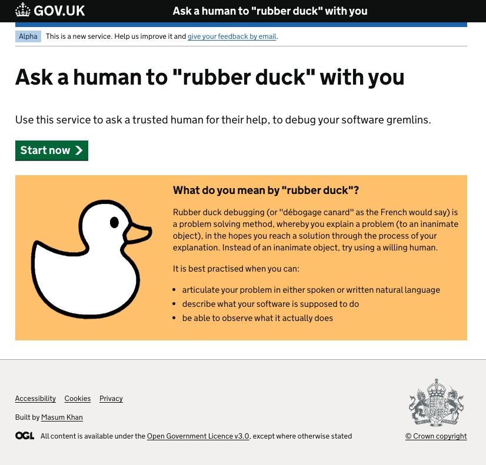
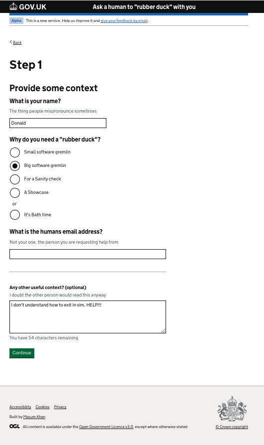
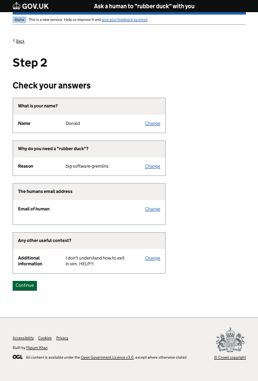
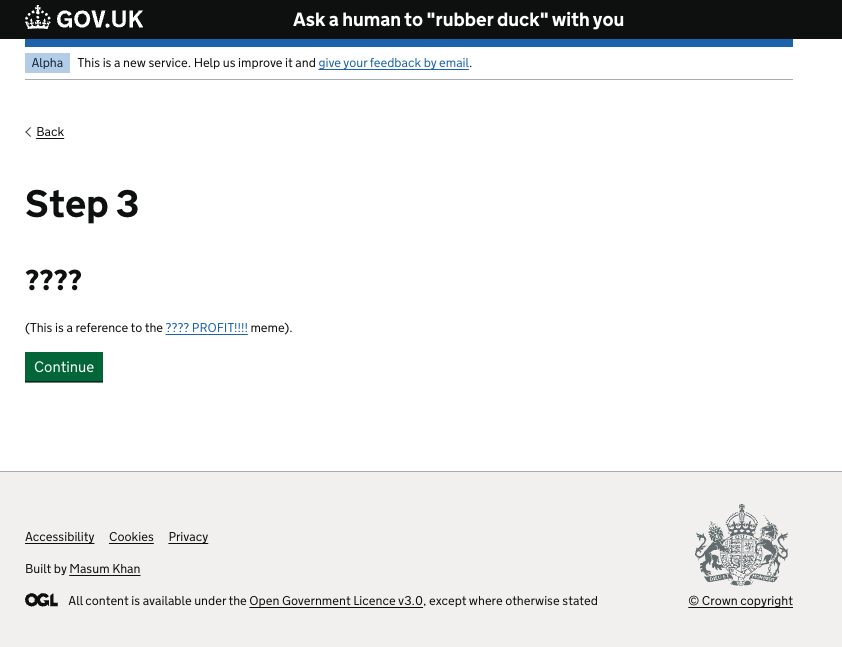
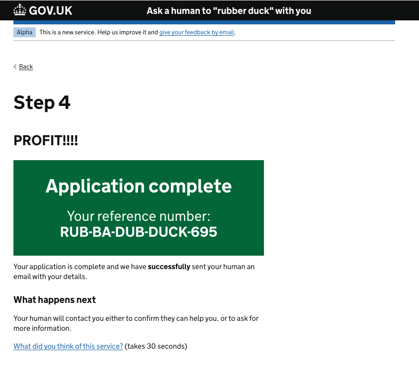
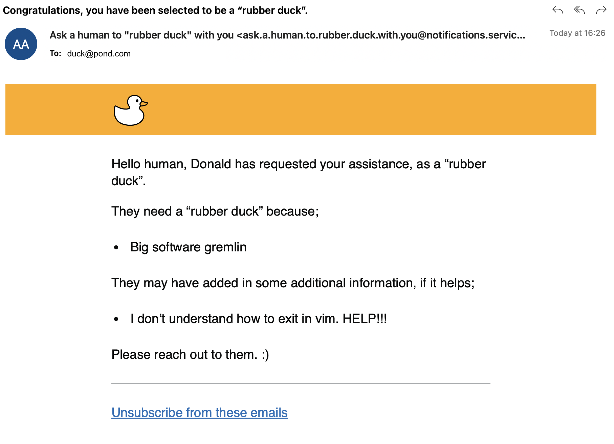

# Ask a human to "rubber duck" with you

This is a Learning & Development repository, to explore the functionality of the [GOVUK Frontend Express JS Skeleton](https://github.com/ministryofjustice/govuk-frontend-express).

This app integrates with the [GOV.UK Notify](https://www.notifications.service.gov.uk/) API, to send an email confirmation - HOWEVER only a allows 5 e-mails to be contacted with the [GOV.UK Notify](https://www.notifications.service.gov.uk/) test account.

## Landing Page
- Use this service to ask a trusted human for their help, to debug your software gremlins. 

## Step 1
- Fill out a short form

## Step 2
- Check you answers

## Step 3
- ????

## Step 4
- Profit by viewing your confirmation screen and hopefully getting help  

## Confirmation email
- This app integrates with the [GOV.UK Notify](https://www.notifications.service.gov.uk/) API, to send an email confirmation

